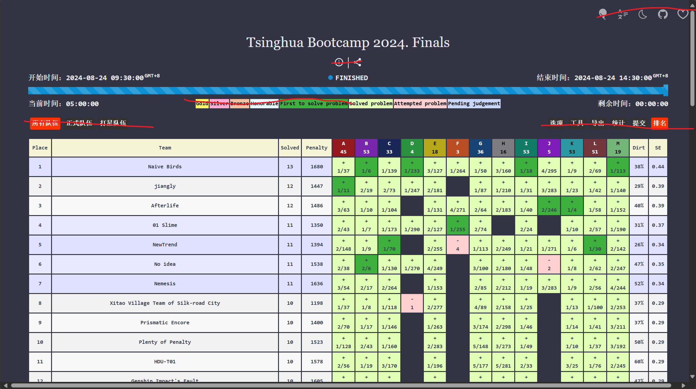

## Board API

### GET /api/board/status

Get the status of the board.

Record object is as follows:

```json
{
  "participantId": "number",
  "participantName": "string",
  "participantDepartment": "string",
  "penalty": "number",
  "solved": "number",
  "submissions": [
    {
      "problemId": "number",
      "tries": "number",
      "time": "number", // timestamp in seconds
      "status": "string", // Accepted or Rejected
    }
  ]
}
```

#### Response

| Field         | Type   | Description                                                    |
| ------------- | ------ | -------------------------------------------------------------- |
| problemCount | number | The number of problems.                                        |
| records       | array  | An array of record objects sorted by solved count and penalty. |

```json
{
  "problem_count": "number",
  "records": [
    {
      "participantId": "number",
      "participantName": "string",
      "participantDepartment": "string",
      "penalty": "number",
      "solved": "number",
      "submissions": [
        {
          "problemId": "number",
          "tries": "number",
          "time": "number",
          "status": "string",
        }
      ]
    }
  ]
}
```

如果过题了（status==Accepted）显示+，

如果尝试了超过1次，tries > 1，+号右边加个"tries-1"的值

比如tries = 1，就只有一个+

tries = 2就是+1

如果没过题，就是-tries

比如-1
-2

然后后端传过来的problemid-1 + 'A'就是题号


